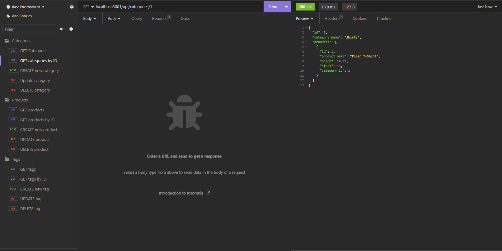

#  Ecommmerce platform

## Project Description
An app to help an ecommerce business manage their inventory. The user app contains a database of products, categories and tags. The user can use the database to find info on their inventory and manage(create/delete) products, categories or tags.

Preview video: https://watch.screencastify.com/v/KuoZyptaikO4TPUFNvlJ

Github: https://github.com/cdziedzic/Ecommerce-platform

### Screenshot of content

## Table of contents

- [Installation](#installation)
- [Usage](#usage)
- [License](#license)
- [Contributing](#contributing)
- [Tests](#tests)
- [Questions](#questions)

### Installation
enter node.mjs into the terminal

### Usage 
Readme creation for projects and challenges

### License

### Contributing
Add any collaborator information here

### Tests
Any tests of the program can be entered into this area

### Questions

[My github](github.com/cdziedzic)

E-mail: cdziedzic@gmail.com